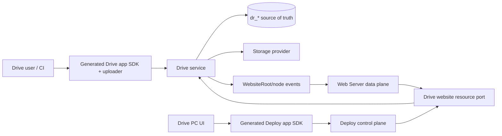
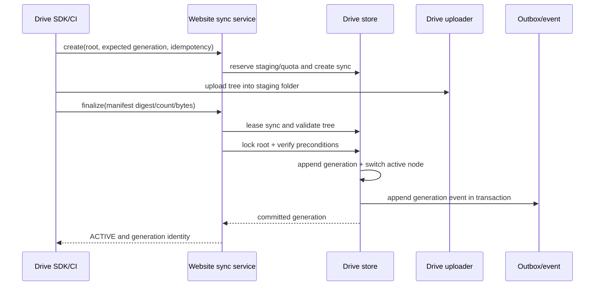

# Drive Website Directory Resource Provider Architecture

Status: active
Owner: SDKWork Drive maintainers
Updated: 2026-07-22
Requirement: REQ-2026-0004
Decision: ADR-20260721-website-space-directory-resource
Specs: ARCHITECTURE_DECISION_SPEC.md, DATABASE_SPEC.md, DRIVE_SPEC.md, API_SPEC.md,
SDK_SPEC.md, APP_SDK_INTEGRATION_SPEC.md, SECURITY_SPEC.md, PRIVACY_SPEC.md,
PERFORMANCE_SPEC.md, OBSERVABILITY_SPEC.md, TEST_SPEC.md, MIGRATION_SPEC.md

## 1. Ownership And Integration



Drive owns Website Space, WebsiteRoot, sync, nodes, versions, upload sessions, storage objects, scan,
retention, and provider events. Deploy owns Site/mount/domain/TLS configuration. Web Server owns
anonymous HTTP delivery. Cross-repository calls use owner-generated SDKs or approved typed service
ports; repositories do not write one another's tables.

### 1.1 Implementation Boundary

| Surface | Current state |
| --- | --- |
| `website` Space type and multi-project uniqueness | implemented in PostgreSQL/SQLite, Rust domain, App API, and generated SDK contracts |
| Default `SPACE_ROOT` and explicit `FOLDER` WebsiteRoots | implemented with transactional default provisioning, immutable selector/idempotency, same-Space/reserved-path validation, and App API create/list/retrieve |
| Trusted Provider validate/resolve/open | implemented through the Drive Internal API and generated Rust SDK for both root modes, including generation/version, conditional/Range, confinement, and non-disclosing failures |
| Root/path change events | implemented for Web freshness without Deploy Release/SiteRevision creation |
| `ATOMIC_SYNC` lifecycle | schema reserved only; command API, manifest/finalize flow, fenced worker, switch/rollback, retention, and cleanup are not implemented |
| User/admin product workflows and commercial operations | incomplete; UI, entitlement/metering reconciliation, load/security/backup/restore, and live fleet evidence remain release gates |

Website eligibility never makes a Space anonymous or public. Public delivery still requires an
active Deploy Site Resource, Variant, Mount, Binding, exact runtime assignment, successful Web
node-local activation, and Deploy's all-frozen-target `ACTIVE` convergence. The node-local probe is
not external public-domain reachability evidence.

## 2. Domain Types

### 2.1 Space Type

The canonical storage/API enum value is `website`. It is a project Space and supports multiple
Spaces for one owner. Enum mirrors, check constraints, storage-provider binding validation, Rust
models, OpenAPI schemas, and generated SDK contracts are materialized from owner sources. Generated
SDK output is not hand-edited. Complete UI labeling remains part of the product-workflow gate.

### 2.2 WebsiteRoot

```text
WebsiteRoot {
  uuid, tenantId, spaceUuid, rootKey, displayName,
  sourceRootMode, selectedFolderNodeUuid, contentMode,
  activeNodeUuid, activeGeneration, status, version
}
```

`sourceRootMode` is `SPACE_ROOT` or `FOLDER`. `selectedFolderNodeUuid` is null for `SPACE_ROOT` and
required for `FOLDER`; the selector is immutable after creation. `contentMode` is `LIVE_TREE` or
`ATOMIC_GENERATION`. In live mode, the active node is the effective selected root. In atomic mode,
the active node is the current managed generation for that logical selector. It is always an active
folder in the same Website Space. `rootKey` stays stable when an atomic generation changes.
Generation increments for every successful switch, including rollback.

Every Website Space provisions a default `SPACE_ROOT` in `LIVE_TREE` mode. Additional `FOLDER` roots are explicit and
entitlement-controlled. The active selector tuple is unique/idempotent within a Space so domains,
Variants, and Sites reuse one provider resource rather than duplicating roots. Deletion is blocked
while active Deploy resources reference the root unless a governed workflow first pauses and
detaches those Sites.

### 2.3 WebsiteSync

```text
CREATED -> UPLOADING -> VALIDATING -> READY -> SWITCHING -> ACTIVE
    |          |             |          |          |
    +----------+-------------+----------+----------+-> FAILED
    +------------------------------------------------> ABORTED
    +------------------------------------------------> EXPIRED
```

Sync state stores operation, manifest digest, checksum/count, status, and lease identities, not
provider object paths. It references normal staging folder/nodes/upload sessions. A fenced worker
validates and cleans asynchronously; switch is a short transaction.

## 3. Target Database Contract

The portable contract is materialized in the PostgreSQL and SQLite baselines, schema registry,
database contract, and workspace-service SQL. Tables use standard SDKWork ID, tenant, audit,
lifecycle, and optimistic-version fields from `DATABASE_SPEC.md`. Any later migration or destructive
data operation still requires separate human review.

### 3.1 `dr_drive_space`

`website` is present in `space_type`. The unique `(tenant_id, owner_subject_type,
owner_subject_id, space_type)` rule is type-aware so it does not prevent multi-instance website
projects. The materialized rules:

- preserve uniqueness for canonical singleton Space profiles;
- permit multiple active `website` rows per owner;
- add tenant/owner/project `space_key` or approved slug uniqueness;
- keep PostgreSQL, SQLite, validators, stores, tests, OpenAPI, and SDKs aligned.

### 3.2 `dr_drive_space_website_profile`

| Column | Contract |
| --- | --- |
| `space_id` | unique FK to active Website Space |
| `project_key` | tenant/owner-scoped stable project key |
| `default_root_id` | nullable during bootstrap, then WebsiteRoot FK |
| `case_collision_policy` | `REJECT` default |
| `retained_generation_count` | bounded and entitlement-controlled |
| `sync_policy` | `ORDINARY`, `ATOMIC_RECOMMENDED`, `ATOMIC_REQUIRED` |
| `profile_status` | active/suspended/archived |

Delivery cache, header, index, fallback, domain, and TLS policy do not belong here.

### 3.3 `dr_drive_website_root`

| Column | Contract |
| --- | --- |
| `space_id` | owning Website Space FK |
| `root_key` | unique stable key inside Space |
| `display_name` | operator label |
| `source_root_mode` | `SPACE_ROOT` or `FOLDER`; immutable |
| `selected_folder_node_id` | null for `SPACE_ROOT`; required same-Space descendant folder for `FOLDER`; immutable |
| `content_mode` | `LIVE_TREE` or `ATOMIC_GENERATION` |
| `active_node_id` | active folder FK in same Space |
| `active_generation` | monotonic int64, starts at 1 |
| `root_status` | `ACTIVE`, `SUSPENDED`, `ARCHIVED`, `INVALID` |
| `last_switch_at`, `last_switch_by` | switch observation |

Unique `(tenant_id, space_id, root_key)` and an engine-portable uniqueness strategy over the
normalized selector `(tenant_id, space_id, source_root_mode, selected_folder_node_id-or-sentinel)`;
lookup `(tenant_id, uuid, root_status)`. The selector validator resolves the canonical Space root or
checks folder type, same-Space ancestry, active lifecycle, quarantine, and reserved namespace. The
switch transaction checks content mode, expected version, and generation.

`SPACE_ROOT` includes the canonical root's active user content but excludes trash, staging,
versions, `.sdkwork`, provider-management, and every other Drive-reserved namespace. A `FOLDER`
selector maps that folder to provider `/`; ancestor rename/move does not alter public relative paths,
while deletion, quarantine, archival, or loss of eligible ancestry marks the WebsiteRoot invalid.

### 3.4 `dr_drive_website_root_generation`

Immutable history columns: `website_root_id`, `generation_no`, `root_node_id`, optional
`source_sync_id`, `manifest_sha256`, `file_count`, `total_bytes`, `generation_status` (`CURRENT`,
`RETAINED`, `EXPIRED`, `DELETING`, `DELETED`, `INVALID`), `activated_at`, `activated_by`, and
`retention_until`. Unique `(website_root_id, generation_no)` and one CURRENT generation/root.

The table does not copy file entries. Normal Drive nodes/versions are authoritative, and this
history is not a Deploy Release.

### 3.5 `dr_drive_website_sync`

| Column | Contract |
| --- | --- |
| `website_root_id`, `space_id` | target scope |
| `idempotency_key` | tenant-scoped unique request identity |
| `expected_root_version`, `expected_generation` | concurrency preconditions |
| `staging_node_id` | isolated folder in target Space |
| `manifest_sha256` | canonical manifest digest |
| `manifest_file_count`, `manifest_total_bytes` | declared/validated bounds |
| `uploaded_file_count`, `uploaded_total_bytes` | progress observations |
| `sync_status` | lifecycle state above |
| `lease_owner`, `lease_token`, `lease_expires_at` | fenced worker claim |
| `expires_at`, `validated_at`, `activated_at`, `completed_at` | lifecycle times |
| `error_code`, `error_summary` | bounded redacted failure |

Indexes support tenant/root/status lists, worker ready/retry/lease scans, and staging cleanup.
Manifest entries must not become one unbounded JSON row; use bounded pages/evidence or a separately
reviewed child contract if durable per-path diagnostics are required.

### 3.6 No Deployment Duplication

Drive does not add Site, Binding, domain, certificate, SiteRevision, public delivery analytics, or
public request tables. Connected Deploy resources are SDK/service observations, not writable copies.

## 4. Atomic Sync Transaction



Validation streams/paginates the tree rather than collecting it. Canonical manifest hashing orders
normalized paths deterministically. Checks include complete uploads, exact path/type/size/checksum,
no forbidden extras, bounded depth/count/path/size, no canonical/case collision, shortcut or reserved
node, passed scan/quarantine policy, same-Space staging, quota, and optional required entry file.

Duplicate finalize returns the same result. A stale expected generation conflicts without changing
the current root. The transaction updates only root/generation/sync/outbox state; bytes already exist.

## 5. Resource Provider Contract

### 5.1 Validate

`validateWebsiteResource` accepts tenant/Space/WebsiteRoot stable identities and authenticated
Deploy context. It verifies Website Space type, ownership, immutable selector, root mode, selected
folder ancestry where applicable, content mode, active folder/generation, reserved namespace,
storage/scan readiness, and capabilities. It returns stable identities, selector observations,
generation, limits, and capability flags.

### 5.2 Resolve And Open

```text
resolve(rootUuid, normalizedRelativePath, conditions, context)
  -> NOT_FOUND | NOT_MODIFIED | FILE(metadata, version) | DIRECTORY(metadata)

open(rootUuid, normalizedRelativePath, contentVersion, range, context)
  -> bounded metadata + streaming body
```

Resolution pins a root generation and content version so a concurrent switch cannot mix metadata
and bytes. The adapter uses Drive repositories/storage ports, not a second object-store integration.
Metadata includes MIME candidate, size, checksum/ETag source, modified time, immutability, and range
capability, but no provider URL or key.

Path traversal uses indexed parent/name lookup or an equivalent canonical path projection with
lineage and rebuild strategy. Full-tree collection per request is forbidden.

### 5.3 Authorization

Provider authorization confirms service identity and the active root authorization for the
tenant/Site purpose. Anonymous browser credentials and guessed node IDs are not accepted. Checks run
before storage access and existence-sensitive diagnostics.

### 5.4 Events

Drive owns an AsyncAPI authority under `apis/events` and emits these versioned generic node facts:

- `drive.node.version.committed.v1`;
- `drive.node.path.changed.v1`;
- `drive.node.eligibility.changed.v1`;
- `drive.node.deleted.v1`.

WebsiteRoot-specific families additionally include
`drive.website_root.generation.changed.v1` and
`drive.website_root.eligibility.changed.v1`. Events carry stable Space/root-scope/node/version
identities, required old/new relative paths, operation ID, sequence/checkpoint, and time. They
contain no body, object key, provider URL, or secret. Outbox commit is atomic with the source
mutation where required.

A node may belong to the default Space-root resource and one or more explicit ancestor Folder-roots.
Drive maintains or derives bounded root-membership indexes and emits/reconciles one root-qualified
effect for every impacted active WebsiteRoot. Move events include the old and new membership/relative
path sets. Consumers never infer root membership from an unqualified node event.

The same root-qualified mechanism supports an authorized Knowledgebase `sources/raw` watch without
making a `knowledge_base` Space website-eligible. Drive records a stable consumer scope/subscription
identity and returns the matching old/new relative paths in `rootScopes`; Knowledgebase fences a
durable checkpoint by tenant, Drive Space, and subscription. A node event without the registered
scope context cannot be used to infer Knowledgebase membership. Replay, dead letter, compatibility,
lag and bounded root reconciliation are part of the event contract.

## 6. API And SDK Surfaces

The implemented App API exposes WebsiteRoot create/list/retrieve over the existing Space workflow;
the trusted Internal API exposes Provider validate/resolve/open through the generated SDK. Remaining
target groups are:

- `websiteSpaces` create/list/retrieve/update/archive;
- `websiteRoots` create/list/retrieve/update/switch/rollback;
- `websiteSyncs` create/retrieve/list/finalize/abort/retry;
- existing `uploader` methods for all bytes;
- bounded validation/plan/problem results.

WebsiteRoot creation uses a discriminated selector rather than nullable guesswork:

```text
SPACE_ROOT { mode }
FOLDER     { mode, folderNodeUuid }
```

`contentMode` is a separate required field. Changing the selector creates/reuses a different
WebsiteRoot; changing a Deploy Site to that root is configuration revision work. Provider open and
event contracts receive only the stable WebsiteRoot identity, never a client-supplied folder path.

The Drive-owned `sdkwork-drive-internal-api` and generated `sdkwork-drive-internal-sdk`, or an
equivalent standalone Rust port, expose resource validate/resolve/open/events and root-scoped change
subscriptions. No anonymous node routes are added. Mutations use idempotency and optimistic
versions; lists use store pagination. App/component manifests must declare event production before
integration can be claimed.

Drive PC consumes generated Drive app SDK/uploader. Deploy integration is a declared dependency app
SDK/service facade sharing the authenticated TokenManager, used only for Deploy-owned summaries and
actions. No raw HTTP or manual auth is introduced.

## 7. UI Module Boundaries

Drive user packages own Website Space list/create, Website explorer, sync drawer, WebsiteRoot,
versions, Drive quota, and integration status. They do not duplicate domain/TLS/Variant policy.

Drive backend-admin packages own storage/provider/scan/sync/root/quota/audit operations through the
generated backend SDK. Support diagnostics show stable IDs and bounded reasons, not content or
storage secrets.

## 8. Security And Privacy

- tenant/Space/root predicates at service/store/storage/event/cache boundaries;
- canonical path validation before lookup and at provider boundary;
- V1 shortcut rejection and active root same-Space invariant;
- checksums, completed uploads, scan status, and quota before activation;
- public share links are not provider authorization;
- no object/secret identity in DTOs, events, logs, metrics, or audit;
- bounded manifests/errors and redacted file names in fleet metrics;
- step-up/impact confirmation for transfer, delete, force detach, and privileged actions;
- cleanup rechecks current/retained/legal-hold protection before deleting staging/old roots.

## 9. Failure Semantics

| Failure | Behavior |
| --- | --- |
| Upload/session failure | sync remains non-ready; current generation unchanged |
| Manifest/tree mismatch | fail bounded validation; no switch |
| Concurrent switch | expected-generation conflict; stale worker fenced |
| Worker crash | lease expires; new worker resumes idempotently |
| Event failure | outbox retry; consumers reconcile through provider |
| Storage outage | bounded retry/circuit; root state not falsely changed |
| Cleanup crash | idempotent retry; protected generations rechecked |
| Quota exceeded | no switch; reservation/staging follows policy |
| Malware status change | eligibility event; provider fails closed |

## 10. Performance, Observability, And Capacity

Safety limits cover Spaces/owner, roots/Space, syncs/root, uploads, manifest pages/bytes, file count,
tree depth, path/name/file size, staging bytes, retained generations, provider concurrency, event
backlog, and cleanup batch. Plan limits may be lower, never higher.

Root membership and provider path lookup are indexed or incrementally projected. A mutation may fan
out only to the bounded active ancestor-root set for its Space; no request or event handler scans all
WebsiteRoots, all nodes, or all tenants.

Tests include small-file-heavy/large-file trees, large bounded manifests, multipart upload, checksum
CPU, concurrent edit/switch/read, hot range streams, storage slowdown, event storms, and repeated
failed cleanup. Root switch time does not scale with object bytes.

Telemetry covers Space/root/sync counts, state/duration/files/bytes/failure, reservation/quota,
staging age/orphans, switches/rollback, provider validate/resolve/open, storage/scan, event lag/gap,
cleanup, and authorization denial. Per-root details remain in logs/traces/admin queries, not
high-cardinality metrics.

## 11. Migration And Rollout

1. Maintain the accepted type vocabulary, root-selector/content-mode union, singleton catalog,
   tables, permissions, and API ownership.
2. Maintain the implemented dual-engine website profile/root/sync/generation schema and validators.
3. Maintain owner-generated App/Internal SDKs and complete user/admin UI behind tenant feature flags.
4. Maintain the implemented typed Provider and Web activation path; add external public-domain
   multi-vantage evidence in a non-public shadow environment.
5. Implement and pilot atomic React/Vite sync, rollback, retention, and cleanup over the existing
   live ordinary static-content baseline.
6. Certify freshness, outage, rollback, cleanup, quota, security, backup/restore, and commercial
   operations before launch.

Existing generic Spaces are not silently converted. Ad hoc deployment-space content is explicitly
copied/imported into a Website Space if a tenant chooses to adopt the feature.

## 12. Verification Matrix

| Boundary | Evidence |
| --- | --- |
| Database | dual-engine migration, type-aware uniqueness, constraints, indexes, lifecycle |
| Domain | enum/profile/root selector/content mode/generation/sync invariants and concurrency |
| Upload | canonical uploader, resume/checksum/attribution/quota |
| Atomic sync | complete/mismatch/failure/cancel/idempotency/conflict/crash/rollback/cleanup |
| Provider | auth, confinement, indexed path, pinned generation/version, range/stream |
| Security | tenant/Space/root, reserved namespace, overlapping roots, traversal, shortcut, quarantine, guessed ID, object-key absence |
| Events | outbox, duplicate/order/gap/replay/reconcile/freshness |
| SDK/UI | owner generation, dependency imports, user/admin permission and state E2E |
| Performance | large tree, small files, concurrent sync/read, memory/CPU/storage/event soak |
